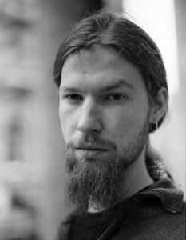
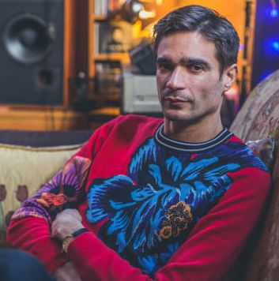
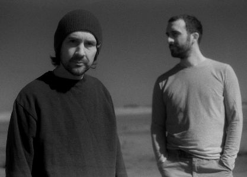
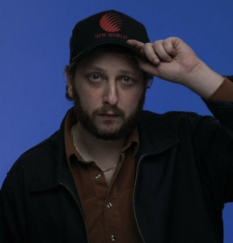
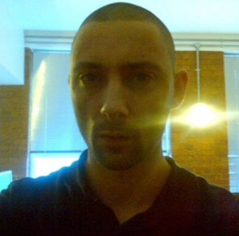

First blog post ever, how exciting!
A lot more interesting things coming up in the future.

Here's a list of my top 5 favourite electronic music producers in **no particular order**.

- Aphex Twin
  

  Aphex Twin is a moniker of Richard David James is a British electronic music producer, his music style includes, techno, ambient, his style has taken infulence from other genres like glitch, experimental, acid house, D&B.  
   And he has been known for a subgenre called IDM or Intelligent Dance Music, his signature style of pseudo-transcendent beats and rad electronic soundscapes.

  He has worked under other names/monikers such as AFX, Polygon Window and many other.

  Favourite tracks:
  `Stone In Focus, Aistasana, Avril 4th, Quoth, Luke Vibert-Spiral Staircase(AFX remix)`  
   <a href="https://aphextwin.warp.net/" target="_blank">Link to his works</a>

- Jon Hopkins
  

  Jonathan Julian Hopkins is an English electronic music producer and performer, he is known for his works that span multiple genres. He has worked with amazing artists like Imogen Heap and Brian Eno!

  His music can be best described as melodic instrumental electronic music, he often flirts with techno and uses various sound effects on his tracks which create a very immersive listening experience.

  His recent album Singularity is one of my favourites because of its "space theme", his transcendental beats and melodic piano pieces are a treat for the brain.

  Favourite tracks:
  `Sun Harmonics, Singularity, Emerald Rush, Small Memory, Candles.`  
   <a href="https://jonhopkins.co.uk/releases" target="_blank">Link to his works</a>

- Boards of Canada (BOC)
  

  BOC are not Canadian as you would imagine, They're originally from Edinburgh, United Kingdom, The duo's name comes from National Film Board of Canada (NFBoC), whose films these young brothers grew up watching.

  When talking about genres, their works can be catergorized under IDM, Ambient, Dark Ambient and Psychedelic.

  But when you come to the kind of feelings their music produces in you resembles nostalgia, which is to be credited to their style of recording, they use various old school techniques, involving analog synths, the sounds they work with are low fidelity which gives them a grainy, rustic texture. Their music is drone-ish and vivid with its imagery.

  Listening to BOC is like getting lost in the cold dark space, it's fear inducing, hope evoking, overall a very engaging listening experience.

  Favourite tracks:
  `Everything you do is a baloon, White Cyclosa, Turquoise Hexagon Sun, Music Is Math, Peacock Tail.`  
   <a href="https://bleep.com/artist/78-boards-of-canada" target="_blank">Link to their works</a>

- Oneohtrix Point Never
  

  Daniel Lopatin or as known by his alias Oneohtrix Point Never, a Brooklyn based music producer, OPN's music career spans across many genres such as Drone, Progressive Electronic Music, Ambient, Post-Industrial, Plunderphonics, Art Pop, Etc.  
   He tends to reinvent himself with his each release.

  His music has a surreal, aural feel thanks to his very unique raw synth style with a lot of classical undertones,
  idyllic music used by a futuristic cult.  
   His music can get from 'tranquilizing' to 'what in the tarnation' very quick.  
   He uses a lot of warpy, glitchy effects, sometimes it's synthetic, glossy, resulting in agaping and vocal imagery, his Plunderphonics works sound apocalyptic, vapourwave-ish with a new age aesthetic.

  He has also composed scores for films such as Uncut Gems and Good Time.

  Favourite tracks:
  `Uncut Gems, Music For Steamed Rocks, Chrome Country, Replica, Boring Angel.`  
   <a href="https://bleep.com/artist/78-boards-of-canada" target="_blank">Link to his works</a>

- Burial
  

  William Emmanuel Bevan AKA Burial is a British Electronic Music producer, best known for his album Untrue which was nominated for Mercury music prize.  
  His style of music has its own genre called Future Garage, his drums/precussions/hi-hats are the most unique in the sense that they're raw, hard to define and he has ispired numerous other producers

  Burial isn't shy of sampling music/vocals from other artists, he is often heard utlizing effects from video games (eg., Metal Gear Solid), he uses seemingly rudimentary digital audio editing software called Sound Forge which is not an advance DAW like Ableton or FL Studio.

  Burial's music is often described as sad, gloomy and distant.  
  I find it caringly introspective, it has beautiful poetic moments that fill you with sorrow, loneliness and regret.
  It nurtures fascination for lost futures of could haves and would haves.  
  Burial is to be experienced and shared with your loved ones.

  Favourite tracks:
  `Archangel, Claustro, State Forest, Rival Dealer, Stolen Dog.`  
   <a href="https://open.spotify.com/artist/0uCCBpmg6MrPb1KY2msceF?si=d_Nhwq_MRCShK6wVki2acw" target="_blank">Link to his works</a>

Might add more artists to this list later,  
Thank you for reading, have a good day.
